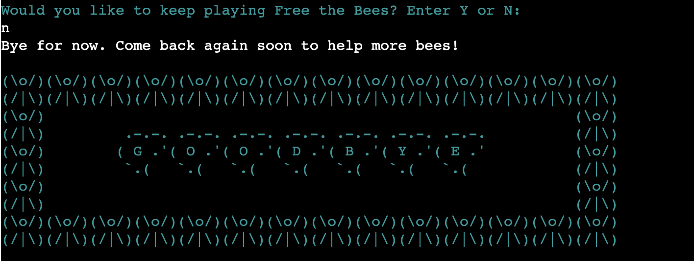
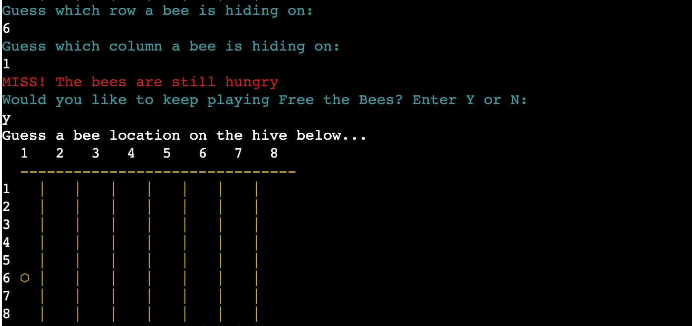
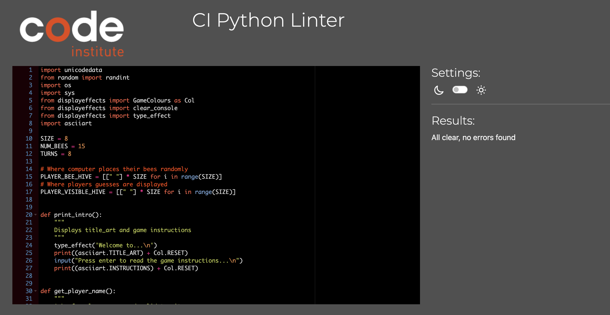

# FREE THE BEES GAME IN PYTHON

Free the Bees is a command line application built in Python designed based on the idea of Battleships... but for people who would prefer not to think about explosions. A simple yellow display brightens peoples day and they can enjoy the fun of finding the bees and feeding them.
Bees are crucial to the planet as we know it. Colony Collapse Disorder was first seen in Southern and Western Europe in 1998, and it was named in 2006 in North America. It is now a world wide occurance that we still don't fully understand.
This game aims to provide entertainment while highlighting the importance of these very clever insects.

[View Free the Bees Live Site](https://fed-the-bees-4595451a08dc.herokuapp.com/)

---

## CONTENTS

- [FREE THE BEES](#free-the-bees)
  - [CONTENTS](#contents)
  - [User Experience (UX)](#user-experience-ux)
    - [How to Play](#how-to-play)
    - [Key information for the site](#key-information-for-the-site)
      - [Goals](#goals)
      - [First Time User Goals](#first-time-user-goals)
      - [Returning Visitor Goals](#returning-visitor-goals)
  - [Design](#design)
    - [Colour Scheme](#colour-scheme)
    - [Typography](#typography)
    - [Lucidchart](#lucidchart)
  - [Features](#features)
    - [General features](#general-features)
      - [The Title Art](#the-title-art)
      - [The Backstory and Instructions](#the-backstory-and-instructions)
      - [The Hive](#the-hive)
      - [Feedback](#feedback)
      - [Final Feedback](#final-feedback)
      - [Finish the Game](#finish-the-game)
    - [Future Implementations](#future-implementations)
    - [Accessibility](#accessibility)
  - [Technologies Used](#technologies-used)
    - [Languages Used](#languages-used)
    - [Frameworks, Libraries \& Programs Used](#frameworks-libraries--programs-used)
  - [Deployment \& Development](#deployment--development)
    - [Playing on a Local machine or via Gitpod Terminal](#playing-on-a-local-machine-or-via-gitpod-terminal)
    - [Final Deployment to Heroku](#final-deployment-to-heroku)
  - [Testing](#testing)
    - [Input Validations](#input-validations)
    - [Resolved Bugs](#resolved-bugs)
    - [Known Bugs](#known-bugs)
  - [Credits](#credits)
    - [Code Used](#code-used)
    - [Content](#content)
    - [Acknowledgments](#acknowledgments)

---

## User Experience (UX)

Free the Bees is a command line application game played on one screen with elements that update to progress the game and give the user feedback. It is deployed to Heroku to ensure a seamless user experience for players.

### How to Play

Free the Bees is inspired by the well-known game Battleships, with a few key differences. Instead of trying to hurt your opponent, the aim is to help the bees!

1. Load the game on with Chrome web browser and follow the prompts to read the instructions.
1. Enter a player name.
1. Confirm you would like to play by answering 'Would you like to keep playing Free the Bees?' with Y.
1. Guess a row and then a column you think the bee is stuck at
1. Did you feed a bee? The program will tell you and then, when you have confirmed you would like to continue, you will see your guess in the hive. A bee if you found one, an empty hexagon if you missed.
1. You have a limited amount of nectar i.e. number of guesses to help the bees. 
1. If you have another urgent task, you can leave the game when asked 'Would you like to keep playing Free the Bees?' Enter N.
1. Feed as many bees as you can and get your results!
1. At the end of the game, you can leave when asked 'Would you like to keep playing Free the Bees?' by entering N, or play another round of Free the Bees by entering Y.

### Key information for the site

1. A Title Art welcomes the new user to the game and invites them to commence playing.
1. A back story and instructions draw the player in and asks them for their name at the end - input required is highlighted by a different colour.
1. The users guess where they think they can help the bees, and they are rewarded with a unicode bee if they are successful, or a unicode empty hexagon commisserates if they didn't find a bee.
1. At each turn, the user confirms they would like to keep playing, so they don't get stuck in a long loop.
1. Finally, their score is displayed and the user is invited to refresh the game to play again or exit the program.

#### Goals

- To have a fun game.
- To have a program that runs smoothly and is accessible both visually and logistically.
- To prevent the game from crashing due to user input.
- To highlight the importance and the plight of bees in nature.

#### First Time User Goals

- I want to play a game that is intuitive and instructions are easy to follow.
- I want to view the information in an aesthetically pleasing and intuitive way.
- I want to navigate through the game easily and get clear feedback.
- I want a game that does not crash.

#### Returning Visitor Goals

- I want familiarity that improves UX by creating an feeling of ease of use.
- I want a program that offers the chance to leave if I need to.
- I want a game that does not crash.

## Design

### Colour Scheme

Python has a limited amount of colours and styles in the Colorama module.
The obvious choice is a use of Yellow and Black to symbolise the bees and I choose Red text to symbolise the feedback for a hangry Bee when they are not fed, and Green text to celebrate a successfully fed bee to encourage the user to keep going.
When user input is needed, the text turns Cyan to alert the player that their interaction is needed.

### Typography

[Geeks for Geeks](https://www.geeksforgeeks.org/python-ascii-art-using-pyfiglet-module/) gave a tutorial on ASCII art using the pyfiglet module and I decided to use a font that resembled the hexagons in a bee hive because it is easy to read and on theme.

Later on you will see I found the [ASCII ART Archive](https://www.asciiart.eu/text-to-ascii-art) and decided to make things a bit more impactful with a border and some more honeycomb, but I still stuck with the bubble font.

### Lucidchart

- I found the logic of this project really difficult and tangled myself in a number of knots.
- Lucidchart had a number of different drafts.

Lucidchart Attempt 1 of Many 

- As I ended up simplifying the game so I could get my head around it, it changed quite a bit.

Lucidchart Edited Version

## Features

### General features

#### The Title Art

- When users first load the page, the Title Art is displayed to
  - welcome the user
  - introduce the name of the game
  - and let them know who coded the game

Title Art

#### The Backstory and Instructions

- Once the user has confirmed they are ready, the backstory of the game is revealed with instructions on how to play

Backstory

- The player is asked to enter their name and this is validated before moving on
- Then the player is asked to confirm they would like to proceed

Name Input

After each turn, the user is asked if they would like to
- continue
- or exit

Early exit

#### The Hive

Once they have confirmed they would like to proceed, the player sees
  - a visual display of the bee hive where the bees are trapped
  - a request for input a row and column they think the bee is trapped in

The Hive

#### Feedback
  - tells the user if they fed a bee

  - or tells them if they missed

- and if they make a duplicate guess, it lets them know they can try again

- the hive is shown again with a bee at the coordinate the player guess if they successfully fed a bee, or an empty hexagon if they left the bees hungry

#### Final feedback
If they choose to complete all the turns, when the player is out of turns and the game is over
  - the players get their final score
  - along with some personalised feedback. The art is green if they found a bee, and red if all the bees are still hangry.

Final feedback

#### Finish the game
 When they have finished, the player is invited 
- to play another round and the game restarts
- or exit and the program finishes

Goodbye art

### Future Implementations

This project meets the requirements and is ready to play without issues.
If more resources opened up, I could add some additional features:

1. It would be interesting to have the time to work with more features such as the background image, placing the terminal centered in the screen and so on.
2. Varying the mode from 'easy' to 'difficult' would be helpful to make the game even more useful for people of interest levels. This could be achieved by creating a class for the Hive and asking the using to input a SIZE between say 5 and 15.
4. Adding game sounds and exciting animations and more complex artwork would increase interest and novelty.

### Accessibility

I have tried to be inclusive for everyone when coding this project by

- Using clear instructions
- Asking for user input before continuing
- Validating inputs before moving on to the next step
- Using interesting colours and icons
- Testing the game to make sure it does not crash from user input
- Using ARIA labels in the README

## Technologies Used

### Languages Used

This game was made using Python.

### Frameworks, Libraries & Programs Used

[Lucidchart](https://www.lucidchart.com/) - To build a flowchart.

[Github](https://github.com/) - To save and store files for the project.

[Heroku](https://dashboard.heroku.com/apps) - To deploy the game.

[Codeanywhere](https://dashboard.codeanywhere.com/) - To write the code.

[ASCII Art Generator](https://www.asciiart.eu/text-to-ascii-art) - For ASCII art.

[Colorama Library](https://pypi.org/project/colorama/) - For colours.

[Python Tutor](https://pythontutor.com/visualize.html#mode=display) - To test Python code.

[Code Insitute PEP8](https://pep8ci.herokuapp.com/) - To validate Python code.

[Shields](https://shields.io/) - To display the shield icons in this document.

## Deployment & Development

### Playing on a Local machine or via Gitpod Terminal
This project was developed using a [specialized Code Institute template](https://github.com/Code-Institute-Org/python-essentials-template) which simulates a terminal in the Google Chrome web browser. Due to this, I optimized the game to work by deploying the [final version on Heroku](https://fed-the-bees-4595451a08dc.herokuapp.com/), and I do not recommend playing it locally. I have included this section only for completeness.

1. Navigate to the [GitHub repository](https://github.com/kellie-cat/fed-the-bees), and follow [these steps to clone the project](https://docs.github.com/en/repositories/creating-and-managing-repositories/cloning-a-repository) into your IDE of choice
   
   * **Gitpod** only **requires** you to have the **web extension** installed and **click** the **green Gitpod button** from the repositories main page. If you are **using Gitpod** please **skip step 2** below as you do not need a virtual environment to protect your machine.  
  
1. **Create** the **virtual environment** with the terminal command **"python3 -m venv venv".** Once complete add the "venv" file to you're ".gitignore" file and use the terminal command **"venv\Scripts\activate.bat" to activate it.**
   
   * **IMPORTANT** If developing locally on your device, ensure you **set up/activate the virtual environment before installing/generating the requirements.txt file**; failure to do this will pollute your machine and put other projects at risk.
 
1. **Install the requirements** listed in requirements.txt using the terminal command  **"pip3 install -r requirements.txt"**
   * Kindly note that since I developed the project from scratch and installed the required libraries as progressed **I have already included a requirements.txt for this app** by using the terminal command **"pip3 freeze > requirements.txt"** to generate it.

### Final Deployment to Heroku
  
The project was deployed to [Heroku](https://www.heroku.com) using the below procedure:-    
  
1. **Log in to Heroku** or create an account if you don't already have one.
1. **Click** the button labeled **New** from the dashboard in the top right corner, just below the header.
1. From the drop-down menu **select "Create new app"**.
1. **Enter a unique app name**. I called this one "fed-the-bees".
1. Once the web portal shows the green tick to confirm the name is original **select the relevant region.** I left mine as Ireland.
1.  When happy with your choice of name and that the correct region is selected, **click** on the **"Create app" button**.
1. This will bring you to the project "Deploy" tab. From here, navigate to the **settings tab** and scroll down to the **"Config Vars" section**. 
1. **Click** the button labelled **"Reveal Config Vars"** and **enter** the **"key" as port**, the **"value" as 8000** and **click** the **"add"** button.
1. Scroll down to the **buildpacks section of the settings page** and click the button labeled **" add buildpack," select "Python," and click "Save Changes"**.
1. **Repeat step 11 but** this time **add "node.js" instead of python**. 
   * **IMPORTANT** The buildpacks must be in the correct order. If node.js is listed first under this section, you can click on python and drag it upwards to change it to the first buildpack in the list.
1. Scroll back to the top of the settings page, and **navigate to the "Deploy" tab.**
1. From the deploy tab **select Github as the deployment method**.
1. **Confirm** you want to **connect to GitHub**.
1. **Search** for the **repository name** and **click** the **connect** button next to the intended repository.
1. From the bottom of the deploy page **select your preferred deployment type** by follow one of the below steps:  
   * Clicking either "Enable Automatic Deploys" for automatic deployment when you push updates to Github.  
   * Select the correct branch for deployment from the drop-down menu and click the "Deploy Branch" button for manual deployment. 

## Testing

The game was tested as it was built with Python, using the command **pylint**.

The relevant validator for Python, [Code Institute PEP8 Python Linter](https://pep8ci.herokuapp.com/) was used to check the code.

It was manually tested by playing many times and trying to cause an error. As shown in the validation section above, the rigorous validation means that the user cannot break the code by inputing an unexpected value. Their experience is smooth because the code tells them what to input to move on or exit.

#### Input Validations
If the player enters an invalid answer
- they have a chance to retry without crashing the game
- and they receive some feedback on how to make a valid guess

Name validation

Row validation

Column valdidation

Continue valdidation

| Stage | Expected input | Invalid input | Management | Feedback |
| ------ | ------ | ------ | ------ | ----- |
| Name | A name of letters |  A length of <= 2 characters |With len(player) <= 2 | "'INPUT' is not a valid choice, tell the friendly bees your name with a few more letters or characters" |
| - | - | A number of spaces | The extra spaces are stripped | Same as <= 2 characters
| - | - | Numbers only | player.isnumeric() | "Numbers on their own don't count! Try a name with letters or \ncharacters too"
| Row and Column | An integer 1 - 8 | An integer outside the range | not in range(0, 8) |"That is outside the hive. Pick a number 1-8" |
| - | - | An invalid character | ValueError | "That's not a valid choice, it gave an error. Please select a valid row by picking a number from 1-8, then enter"
| Continue | Y / N | lowercase | A lower case letter is converted with .upper and accepted | NA |
| - | - | An invalid character | not == 'Y' or 'N' | "Invalid choice. Please enter 'Y' or 'N'" |

### Resolved Bugs

Many issues were discovered and resolved throughout the project.

1. Trial and error and patience are key. Many times I tried many lines of code that did not work. I learned to just keep trying. Keep calm. Keep breathing.
1. 1. **Issue**: Code not running - 'sys' not found
   1. **Cause**: I had not imported 'sys' correctly on run.py as I had included it in asciiart.py
   1. **Solution**: To import sys in every file it is used in
1. 1. **Issue**: Lines too long in print() or input(), I placed them in a seconded set of () and split them over 2 lines but the white space was shown when the code was run.
   1. **Cause**: Not understanding all the ways to split lines in Python yet
   1. **Solution**: Tutor Support - Thank you Sarah. Such a simple solution but Google had failed me this time.
   Splitting the lines wrapped in '' or "" and correctly indenting them works very nicely.
1. 1. **Issue**: Code not running - file named 'asciiart' not found
   1. **Cause**: I had named asciiart without the '.py' at the end
   1. **Solution**: To make sure naming conventions are followed
1. 1. **Issue**: On occasion, the random co-ordinates duplicated themselves, to there may only be 9 or even on occasion 8 bees.
   1. **Cause**: No validation to check if the random co-ordinates had already been returned.
   1. **Solution**: I appended the random coordinates to a list and added an if statement to run the code again if they already existed in the list.
1. 1. **Issue**: The hive already being populated if the player chose to play again
   1. **Cause**: The previous game's co-ordinates were still in play.
   1. **Solution**: Refreshing the program from the beginning.
1. 1. **Issue**: User had to input N twice to exit the game
   1. **Cause**: I had created a double loop within finish_game(). As it already uses keep_playing() logic, I only needed to ask if the return was False once.
   1. **Solution**: Instead of a second if statement, I coded to exit on else.
1. 1. **Issue**: So many options, so much time lost
   1. **Cause**: I found the ASCII Art Archive at the last minute and found it way more intuitive to use and it offered so many options compared to the previous ASCII art generators I had tried, that I ended up getting distracted by adding some more colours instead of focussing on finshing the README!
   1. **Solution**: Try to find more fun additions earlier in the project, so the deadline isn't stifling my creativity!

### Known Bugs

There are no unfixed bugs in Free the Bees.

## Credits

### Code Used

- [Code Institute Python Template](https://github.com/Code-Institute-Org/python-essentials-template)
- [Kera Cudmore's README.md for the Bully Book Club](https://github.com/kera-cudmore/Bully-Book-Club)
- [David Bower's README.md for Battleships](https://github.com/dnlbowers/battleships/blob/main/README.md)
- [Python OOP Tutorial Playlist by Corey Shafer](https://www.youtube.com/playlist?list=PL-osiE80TeTsqhIuOqKhwlXsIBIdSeYtc)
- [Python Tutorial Series by Knowledge Mavens](https://www.youtube.com/watch?v=xz9GrOwQ_5E)
- [Patt Hoege for the idea to shorten the Colorama commands](https://github.com/patthoege/hangmangame-pp3-python)

### Content

Concept and content written by Kellie McConnell.

### Acknowledgments

Thank you so much to everyone who helped me in this project.

- Corey Shafer from YouTube [Python OOP Tutorial Playlist](https://www.youtube.com/playlist?list=PL-osiE80TeTsqhIuOqKhwlXsIBIdSeYtc). Nothing about classes, or Python in general, really clicked until these. I should have made time to watch them earlier.

- Sarah from Tutor Support and Eva from Student Care - thank you for the help.

- Rohit Sharma, for fitting me in for an extra mentor session to help me simplify the tangle I created.

- David Bowers, my Code Institute Mentor, thank you for your patience in the face of my panic and hopelessness. I really appreciate your positivity in countering the imposter syndrome!